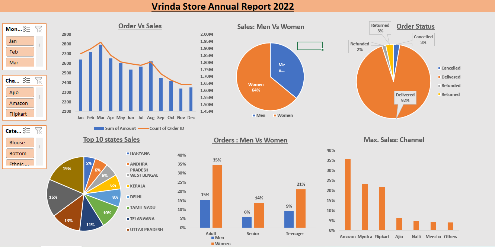

# Vrinda Store Sales Analysis Dashboard (Excel)

## Project Overview
The **Vrinda Store Sales Analysis Dashboard** is an interactive Excel-based dashboard created to analyze annual sales performance across multiple business dimensions. The project focuses on identifying trends in orders, customer segments, sales channels, and regional performance to support data-driven decision-making.

## Tools Used
- Microsoft Excel
- Pivot Tables
- Pivot Charts
- Slicers
- Data Cleaning and Aggregation

## Key Features
- Interactive dashboard for annual sales analysis
- Dynamic filtering by **Month, Product Category, and Sales Channel**
- Analysis of **order trends and monthly performance**
- Visualization of **gender-based sales distribution**
- Breakdown of **order status (Delivered, Cancelled, Returned, Refunded)**
- State-wise sales performance analysis
- Sales channel comparison (Amazon, Flipkart, Myntra, etc.)

## Analysis Performed
- Examined **monthly sales vs number of orders**
- Compared **sales distribution between male and female customers**
- Analyzed **order status patterns**
- Identified **top-performing states contributing to sales**
- Evaluated **sales contribution by different online sales channels**

## Insights
- Identified the **top-performing states contributing the highest sales revenue**
- Found **major sales contribution from leading e-commerce channels**
- Observed customer purchasing patterns across **different product categories**
- Highlighted trends in **order fulfillment and cancellations**

## Dashboard Preview

